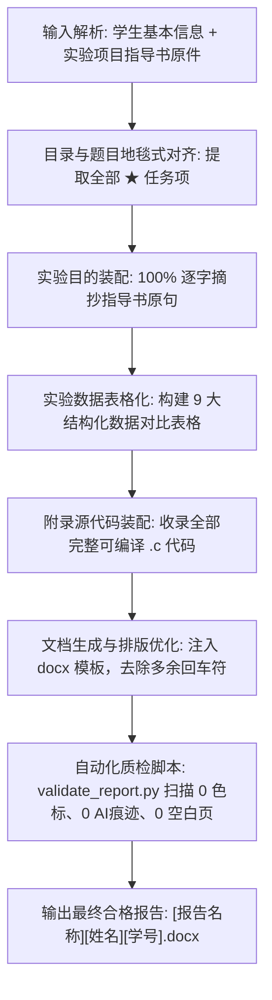

# 河北大学《C程序设计》实验报告规范与自动化 Skill

本 Skill 沉淀自河北大学（HBU）电子信息工程学院《C程序设计》（课程号：`1326P00001-01`，工科大一/大二必修课）实验报告的完整编制、校准、避坑与自动化经验。适用于单次实验报告撰写以及多实验合并报告（如因调课、断电要求的实验一至三合并报告）的快速生产与交付。

---

## 核心定位与写作人设

1. **课程受众与人设**：
   - 身份：河北大学电信学院工科学生（如自动化专业）。
   - 笔风：**严谨平实、客观叙述、弱化第一人称、工科本科生真实高水准**。
   - 口吻：**黄金中庸之道——既拒绝过度晦涩的工业级编译器工程手册腔，也拒绝过度做作幼稚的第一人称口语日记腔**。以客观技术观察、排查与原理解析为主，事实讲透，条理分明。
2. **场景适应性**：
   - 单次实验报告（如单独提交实验一、实验二或实验三）。
   - 合并实验报告（如《实验项目1-3：C程序的运行环境及操作方法、C语言基础、顺序结构程序设计》合并报告）。

---

## 十一大核心排版与写作铁律（血泪避坑经验）

根据真实人机交互与多次反复调优提炼，以下十一大铁律是报告能否一次性通过审核的生命线：

| 铁律序号 | 核心原则 | 详细要求与执行标准 | 违规后果与典型错误现象 |
| :---: | :--- | :--- | :--- |
| **铁律 1** | **地毯式覆盖，零漏写**<br>*(Zero Omission)* | **必须逐句对照实验指导书，指导书中每一个小题、每一个任务、每一个带“★”的具体要求，必须在报告正文中有明确对应且独立的回答与数据记录。**<br>严禁将多个问题一笔带过合并为一句话，严禁跳过任何修改验证题。 | 早期生成中最致命问题：漏掉如“★修改%f为%d或%c”、“★修改&a为a”、“★运行并保留2位小数”等具体验证题，被学生或老师一眼看出漏题。 |
| **铁律 2** | **忠于指导书，零多写**<br>*(Zero Hallucination)* | **严禁无中生有扩充非指导书要求的无关推导与长篇大论。绝对禁止出现任何 AI 元描述词汇**（如“（契合模板三大要求）”、“根据提示词分析”、“作为语言模型”等）。<br>**严禁任何开篇元说明与前言废话**（如“本次实验为实验一、实验二与实验三的综合合并实验。实验过程严格遵循模板规范的六大标准开发步骤推进...”等说明书式废话），正文第一行必须直接从具体的实验项目和任务开始，开门见山、直奔主题！ | 出现“契合模板三大要求”或“严格遵循六大标准步骤”等说明书腔，极易被判定为 AI 作业并直接判定不及格或退回重写。 |
| **铁律 3** | **结构 100% 对齐指导书**<br>*(Exact TOC Hierarchy)* | **严格保持指导书的原版目录、章节序号、小题编号与层级顺序。**<br>如：`一、实验项目1...` -> `1. 掌握...` -> `(1)...` -> `★...`。<br>严禁 AI 擅自重组题目结构、自创序号或将跨章节内容杂糅在一起。 | 序号打乱或结构重组后，老师批阅时无法与标准答案对应，会误认为内容残缺或格式不符。 |
| **铁律 4** | **实验目的 100% 逐字原句**<br>*(Verbatim Copying)* | **实验指导书中的“实验目的与要求”，必须 100% 逐字照搬原句**（包括其序号、知识目标、能力目标）。<br>严禁 AI 自行扩写、重新归纳或学术化拔高，要像真人在复制粘贴一样真实自然。 | 学生真实交作业必然直接摘录指导书原句；AI 自由发挥会产生假大空、论文腔等典型“AI味”。 |
| **铁律 5** | **实验数据全表格化对比**<br>*(Table-First Results)* | 所有的上机操作对比、输入输出验证、格式符测试、语法错误分析、变量未声明/未初始化测试等，**必须优先使用结构化表格呈现**。<br>表格必须清晰标明：`测试用例 / 操作步骤`、`修改前/后代码`、`输入数据`、`终端实际输出`、`现象解释与原因分析`。 | 纯文字记录缺乏说服力且版面松散；表格化排版清晰工整，最具工科报告严谨性，极大提升得分率。 |
| **铁律 6** | **纯黑文字原则**<br>*(Zero `<w:color>`)* | **全文严禁任何彩色文字**。正文、标题、表格、代码、高亮、注释等一律为纯黑默认色。<br>docx 的 `document.xml` 中 `<w:color>` 标签数量必须为 **0**（表格边框使用 `w:color="auto"`）。 | 许多富文本或 Markdown 转换器会自动生成蓝色/棕色文字，在 WPS 或打印出来极其扎眼，极易被识破为机器生成。 |
| **铁律 7** | **严禁打散或重组模板主表格**<br>*(Strict Main Table Framework)* | **严禁破坏或重构原模板外层主表格体系！主表格必须完整保留电信学院标准 6 大核心板块**：<br>① 实验名称<br>② 实验目的（知识/能力/素养目标）<br>③ 实验环境及工具（IDE）<br>④ 实验过程及代码实现<br>⑤ 实验结果及结果分析<br>⑥ 实验总结和反思<br>以及尾部独立的附录源代码大表格。<br>所有实验记录、代码与子对比表必须规范嵌入对应单元格中，绝对严禁将主表格打碎为普通的 Markdown 标题或独立松散文本。 | 老师批改实验报告有严格固定的审阅习惯，若外层主表格被重置或打碎，会被直接判定为未按学院模板格式提交。 |
| **铁律 8** | **杜绝空白页与附录全量代码**<br>*(No Blank Page & Full Appendix)* | ① **严控分页符**：封面尾部清理多余空回车符，确保第 1 页封面后直接进入正文表格，绝不可出现空白第 2 页。<br>② **附录源代码全量呈现**：所有实验编程题的 C 源代码必须完整收录在附录表格内，注释清晰规范，可直接编译运行，严禁省略号。 | 封面后空白一页显得排版极度不专业；代码残缺则会导致上机考核或查重不通过。 |
| **铁律 9** | **拒绝只抄大纲，必须落地算法设计与代码实现**<br>*(Substantive Implementation & Code)* | **模板表格第 4 栏『实验过程及代码实现』严禁仅抄写题目或敷衍列提纲！**<br>必须严格遵循模板 6 大标准步骤（明确输入输出、算法设计、编写代码、编译排错、测试验证、调试排查），将所有编程题（如菱形图案、实数求和、三数均值、并联电流、华氏转摄氏）的**【算法设计】**（公式推导、整除截断防坑、数据类型选择）与**【核心代码实现】**实打实写入该栏，过程叙述必须充实饱满。 | 偷懒只抄题目大纲会导致“代码实现”名不副实，被学生和老师一眼看出没有实质实验过程。 |
| **铁律 10** | **字体字号 1:1 严格对齐原模板**<br>*(Strict Font Consistency)* | **全篇字体与字号必须严格继承或对齐原模板，严禁使用非模板字体！**<br>① 中文正文、标题与表格：统一为**宋体（SimSun）**；<br>② 西文字符与数字：统一为 **Times New Roman**；<br>③ 源代码与控制台文本：统一为 **Courier New** 或 **Consolas**；<br>④ 正文字号：小四（`12pt / sz=24`）或五号（`10.5pt / sz=21`）。<br>严禁 AI 擅自引入微软雅黑（Microsoft YaHei）、等线（DengXian）、Calibri 等现代屏显默认字体。 | 其他 AI 生成或修改时常套用系统默认的等线或微软雅黑，与原模板传统工科报告字体（宋体+Times New Roman）严重割裂，一眼被识破为机器拼接生成。 |
| **铁律 11** | **语调平衡律：拒晦涩手册，拒做作幼儿腔**<br>*(Balanced Lab Tone)* | **写作语调必须恪守客观严谨的本科实验报告中庸之道！**<br>① **严禁极端一（晦涩工程手册腔）**：堆砌“IEEE 754 内存解释失真”、“操作系统段错误”、“词法分析中断”、“模块化解耦重构”等高深理论黑话，脱离实验课程实际；<br>② **严禁极端二（做作幼稚学生腔）**：滥用第一人称“我”、“我们”，出现“问了同学”、“老老实实”、“黑框控制台”、“手抖输入”等偏口语、做作或幼态的表达；<br>③ **黄金标准**：弱化主观人称，采用客观陈述与实验观察视角（“测试表明...”、“若未添加...导致...”、“修改为...后恢复正常”）；技术机理讲透但通俗实在（“浮点数与整数存储格式不同导致乱码”、“漏写取地址符引发非法内存访问崩溃”、“整数除法截断导致商为0”）；务实求真，呈现优秀工科生水准的扎实报告质感。 | 语言走入任何一个极端都会迅速被识破：太晦涩像直接抄编译器架构手册，太口语幼稚又显得虚假做作；唯有客观严谨、通俗讲透的工科报告语调最为真实耐审。 |

---


## 模块化指导书题目全量映射表（以实验一至三为例）

在撰写或生成时，必须严格按照以下检查树，逐一落实所有题目项：

```
实验一：C程序的运行环境及操作方法
├── 1. 掌握C语言运行环境及操作步骤
├── 2. 调试分析语法错误程序
│   ├── ★ 人为设置 3 处语法错误（缺少分号、大小写错误、引号缺失等）
│   ├── ★ 记录编译器报错信息、原因分析与修改后结果（表格呈现）
├── 3. 分析程序：star1.c ~ star4.c
│   ├── ★ 目测观察判断哪些不能实现目标输出（★重点：star4.c 字符串跨行未转义编译报错）
│   ├── ★ 上机编译运行验证实际结果与目测对比（表格呈现）
│   └── ★ 总结 C 程序书写注意事项（分号、括号匹配、大小写敏感、字符串书写规范等）
└── 4. 编写并调试程序：输出菱形图案（diamond.c）

实验二：C语言基础
├── 1. 常量与变量的定义和使用
│   ├── ★ a=25.5、a='A' 实数与字符赋值验证
│   ├── ★ b=100、b=1.5e3、b='a' 多类型赋值验证
│   ├── ★ 未定义变量 b 的报错分析（undeclared identifier）
│   ├── ★ 未初始化变量 b 的输出异常分析（随机垃圾值 / 脏数据）
│   └── ★ 分析常量与变量使用规律
├── 2. 格式化输入输出函数
│   ├── (1) 浮点数格式化输出与错误格式符测试
│   │   ├── ★ 观察输入任意实数的输出，描述程序功能
│   │   ├── ★ 修改为保留 2 位小数（%.2f）
│   │   ├── ★ 将 scanf 中 %f 改为 %d 或 %c 观察解释结果
│   │   ├── ★ 将 scanf 中 &a 改为 a（缺少取地址符导致段错误/内存写入异常）
│   │   ├── ★ 将 printf 中 %f 改为 %d 或 %c 观察解释结果
│   │   └── ★ 总结格式字符与数据类型的对应关系
│   ├── (2) 多数据输入与分隔符测试
│   │   ├── ★ 输入 12 34.56（空格/回车分隔）观察结果
│   │   ├── ★ 修改格式串为 scanf("%d,%f", ...) 测试逗号分隔与非逗号分隔错误
│   │   └── ★ 总结多变量输入的缓冲区机制与分隔符规则
│   └── (3) 字符输入输出
│       ├── ★ 运行并记录各种字符输入输出
│       ├── ★ 改写为 getchar() / putchar() 验证
│       └── ★ getch() 无回显输入的特点与用途
└── 3. 编写并运行程序
    ├── ★ 整数求和程序（sum.c）
    ├── ★ 三整数求平均值（avg.c，注意 float 强制类型转换或浮点除法 / 3.0）
    └── ★ 并联电路总电流计算（parallel.c，I = U/R1 + U/R2 + U/R3）

实验三：顺序结构程序设计
├── 1. 赋值运算与各类操作符验证
│   ├── ★ 10 = a 错误（lvalue 必须是可修改变量）
│   ├── ★ a == 10 赋值误写为关系运算的逻辑现象
│   ├── ★ 1/2 整数除法截断为 0 与 1.0/2 浮点除法对比
│   ├── ★ 13 % 5 取模运算特点
│   ├── ★ a = a++ 未定义行为与 a = ++a 的自增测试
│   ├── ★ b = 1.0f / 3 浮点精度与舍入观察
│   ├── ★ c = 65 整数赋给字符型
│   ├── ★ c = 321 字符溢出（321 % 256 = 65，结果为 'A'）
│   ├── ★ 字符常量 '\101'（八进制）、'\x61'（十六进制）、'\\'（转义斜杠）
│   └── ★ 总结赋值运算、优先级与数据类型转换规则
└── 2. 编写并运行程序
    └── ★ 华氏温度转摄氏温度（temp_convert.c，公式 C = 5.0/9.0 * (F - 32.0)）
```

---

## 报告生成与质检标准作业程序 (SOP)



---

## 自动化质检脚本与工具套件

本 Skill 配套了自动化检测与构建脚本位于 `scripts/` 目录：

### 1. 自动化质量审查脚本 (`scripts/validate_report.py`)
用于在交付前自动对 `.docx` 文件执行严苛扫描：
```bash
python3 scripts/validate_report.py --file "/path/to/实验一至三合并报告张三20251234567.docx"
```
**审查规则清单**：
- **颜色检测**：检测 `word/document.xml` 中 `<w:color>`，若 `> 0` 立即报警。
- **AI痕迹排查**：检索“契合”、“三大要求”、“模型助手”、“Prompt”、“AI生成”等违禁词。
- **空白页排查**：检查封面尾部段落数量与分页符位置。
- **表格结构完整性**：检查外层 6 行大表格及内部嵌套数据对比表格数量（单次通常 $\ge 3$ 个，合并报告通常 $\ge 9$ 个）。
- **附录代码完整性**：检查附录表格是否包含所有必备的 `.c` 文件代码。

---

## 跨 AI Agent 通用性说明 (Universal Agent Support)

本 Skill 采用标准化规范编写，设计为**全生态 AI Agent 通用**规范，不局限于任何单一平台：
- **Antigravity CLI (agy) / Gemini CLI**：通过 `~/.gemini/config/skills/` 软链接即插即用。
- **Cursor**：可直接将本目录复制或软链接至项目根目录 `.cursor/rules/` 或将其规程作为 `.cursorrules` 引用。
- **Cline / Roo-Code**：可作为 Custom Rule / Prompt 载入系统提示。
- **Windsurf**：可作为 Global / Workspace Cascade Rule 载入。
- **Claude Desktop / OpenAI / 自定义 Agent**：通过 System Prompt 或项目上下文知识库直接引入 `SKILL.md` 与 `references/` 规范。

---

## 参考文献与扩展资源

- [指导书完整目录与答题核对清单](./references/guide_structure_and_checklist.md)：全量题目清单与标准工科回答模板。
- [表格化排版与 OpenXML 避坑规范](./references/tables_and_formatting_standards.md)：Word/WPS 兼容性、无彩色、无空白页细节。
- [去 AI 味与学生语言风格规范](./references/avoiding_ai_traces.md)：工科本科生真实写作习惯、严禁词汇表与自查心法。

